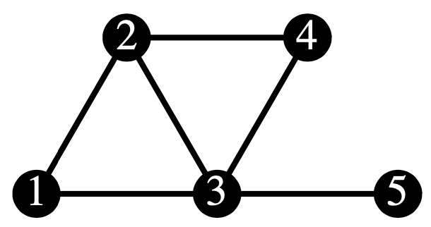

```{r setup, include=FALSE}
knitr::opts_chunk$set(echo = TRUE)
library(tidyverse)
library(plotly)
library(expm)
library(LearnBayes)
library(coda)
source("mcmc_util.R")
```

# 1. Random walk on graph

We consider the simple random walk on the following graph.

```{r, echo=FALSE, out.width = '50%', fig.align="center"}

```

The transition matrix $P$ for the simple random walk is as follows.

```{r graph RW transition matrix}
edges <- list(c(1, 2), c(1, 3), c(2, 3), c(2, 4), c(3, 4), c(3, 5))
P <- make_rw_transition_matrix(5, edges, FALSE)
P
```

Recall from the previous lecture that the stationary distribution can be found using the formula $\pi(k) = \frac{\text{deg}(k)}{2|E|}$, i.e. we have
$$
\pi = (1/6, 1/4, 1/3, 1/6, 1/12)
$$
We can approximate the stationary distribution by taking a high matrix power.
```{r graph RW stationary distribution}
P %^% 50
```
We now sample a trajectory from this chain and plot it.

```{r sample from trajectory}
T <- 100
trajectory <- sample_trajectory(T, P, 1)
plot_trajectory(trajectory)
```


```{r space and time averages, cache=TRUE}
T <- 200
M <- 200
trajectories <- matrix(0, M, T+1)
for (m in 1:M) {
  trajectories[m, ] <- sample_trajectory(T, P, 1)
}
```


```{r space average}
table(trajectories[, T+1]) / M
```

```{r time average}
table(trajectories[1, ]) / (T+1)
```

# 2. Metropolis-Hastings filter for random walk on graph

We consider the same graph as in Part 1, but now our target distribution is
$$
\pi = \left(0.1, 0.1, 0.1, 0.2, 0.5\right).
$$
```{r mh space and time averages, cache=TRUE}
target <- c(0.1, 0.1, 0.1, 0.2, 0.5)
T <- 200
M <- 200
trajectories <- matrix(0, M, T+1)
for (m in 1:M) {
  trajectories[m, ] <- sample_mh_trajectory(T, P, 1, target)
}
```


```{r mh space average}
table(trajectories[, T+1]) / M
```

```{r mh time average}
table(trajectories[5, ]) / (T+1)
```
We observe that the chain takes longer to converge to the stationary distribution. Since we are working with a finite state space chain, we can also write an updated transition matrix.

```{r mh transition matrix}
Q <- make_mh_transition_matrix(P, target)
Q
```

```{r}
# print(Q %^% 50)
# print(Q %^% 100)
print(Q %^% 500)
```

# 3. Example for Metropolis-Hastings on continuous state space

We wish to learn about a normal population from grouped data. Refer to the additional slides for details of this example and explanation of the code snippets.

```{r Display grouped data}

data <- cbind( c(-Inf,66,68,70,72,74),
               c(66,68,70,72,74,Inf),
               c(14,30,49,70,33,15) )
tibble(left = data[, 1],
       right = data[, 2],
       count = data[, 3])
```

```{r Log density function}

dpnorm <- function(a, b, mu, sigma){
  # Function that computes the probability of one bin
  pnorm(b,mean=mu,sd=sigma) - pnorm(a,mean=mu,sd=sigma)
}

h <- function(theta, data){
  # Function that computes the log posterior
  G <- nrow(data)
  L <- 0
  mu <- theta[1]
  sigma <- exp(theta[2])
  for (g in 1:G){
    L <- L + data[g,3]*log(dpnorm(data[g,1],data[g,2],mu,sigma))
  }
  return(L)
}
```

```{r Contour plot of log density}

N <- 100
theta1 <- seq(from=66, to=74, length.out=N)
theta2 <- seq(from=0, to=2.5, length.out=N)
z <- matrix(0,N,N)
for (i in 1:N){
 for (j in 1:N){
   theta <- c(theta1[i], theta2[j])
   z[i,j] <- h(theta,data)    
}}

par(mar=c(3.5,3.5,1,1))
par(mgp=c(2.1,0.8,0))
contour(x=theta1,y=theta2,z,col="blue",nlevels=30,
        xlab=expression(mu),ylab=expression(lambda),
        cex.axis=1.1,cex.lab=1.3,labcex=1.1)
```

```{r Compute normal approximation (to get proposal for MH)}
start <- c(70,1)
out <- optim(par=start,fn=h,hessian=TRUE,
        control=list(fnscale=-1),data=data)
(post.mode <- out$par)
(post.cov <- -solve(out$hessian))
```


```{r Run MH}
# Select proposal to be a normal with the fitted covariance and with scale = 2
proposal <- list(var=post.cov,scale=2)
set.seed(1)
fit1 <- rwmetrop(h, proposal,start,10000,data)
fit1$accept
```

```{r Compute posterior mean and sd}
(post.means <- apply(fit1$par[5001:10000,],2,mean))
(post.sds <- apply(fit1$par[5001:10000,],2,sd))

post.mode
sqrt(diag(post.cov))
```

```{r Scatter plot of MCMC samples}
# contour plot
N <- 100
theta1 <- seq(from=69, to=71.4, length.out=N)
theta2 <- seq(from=0.65, to=1.3, length.out=N)
z <- matrix(0,N,N)
for (i in 1:N){
 for (j in 1:N){
   theta <- c(theta1[i], theta2[j])
   z[i,j] <- h(theta,data)    
}}


par(mar=c(3.5,3.5,1,1))
par(mgp=c(2.1,0.8,0))
contour(x=theta1,y=theta2,z,col="blue",nlevels=20,
    xlab=expression(mu),ylab=expression(lambda),
    cex.axis=1.1,cex.lab=1.3,labcex=1.1)
points(fit1$par[5001:10000,])

```


```{r MH with alternate initialization and scale (Algorithm 2)}
start <- c(65,1)
proposal <- list(var=post.cov,scale=0.2)
set.seed(1)
fit2 <- rwmetrop(h,proposal,start,10000,data)
fit2$accept
```

```{r Compute traceplots}
# create mcmc objects (if input is a matrix, 
# each column should represent one variable)
require(coda)
colnames(fit1$par) <- c("mu","lambda")
colnames(fit2$par) <- c("mu","lambda")
mcmcobj1 <- mcmc(fit1$par)
mcmcobj2 <- mcmc(fit2$par)

# traceplots
par(mar=c(3.5,2,1,1))
par(mgp=c(2.1,0.8,0))
par(mfrow=c(1,2),oma=c(0,0,1,0))
traceplot(mcmcobj1)
title("Algorithm 1", outer=TRUE)

par(mar=c(3.5,2,1,1))
par(mgp=c(2.1,0.8,0))
par(mfrow=c(1,2),oma=c(0,0,1,0))
traceplot(mcmcobj2)
title("Algorithm 2", outer=TRUE)
```


```{r Compute traceplots after removing burn-in}
# remove burn-in period
mcmcobj1 <- mcmc(fit1$par[2001:10000,])
mcmcobj2 <- mcmc(fit2$par[2001:10000,])

# traceplots
par(mar=c(3.5,2,1,1))
par(mgp=c(2.1,0.8,0))
par(mfrow=c(1,2),oma=c(0,0,1,0))
traceplot(mcmcobj1,cex.lab=1.2)
title("Algorithm 1", outer=TRUE, cex.main=1.5)

par(mar=c(3.5,2,1,1))
par(mgp=c(2.1,0.8,0))
par(mfrow=c(1,2),oma=c(0,0,1,0))
traceplot(mcmcobj2,cex.lab=1.2)
title("Algorithm 2", outer=TRUE, cex.main=1.5)
```

```{r Compute autocorrelation plots}
# autocorrelation plots
par(mar=c(3.5,2,1,1))
par(mgp=c(2.1,0.8,0))
par(mfrow=c(1,2),oma=c(0,0,1,0))
autocorr.plot(mcmcobj1)
title("Algorithm 1", outer=TRUE, cex.main=1.5)

par(mar=c(3.5,2,1,1))
par(mgp=c(2.1,0.8,0))
par(mfrow=c(1,2),oma=c(0,0,1,0))
autocorr.plot(mcmcobj2)
title("Algorithm 2", outer=TRUE, cex.main=1.5)
```

```{r Compute summary including ESS}
summary(mcmcobj1)
summary(mcmcobj2)
```
